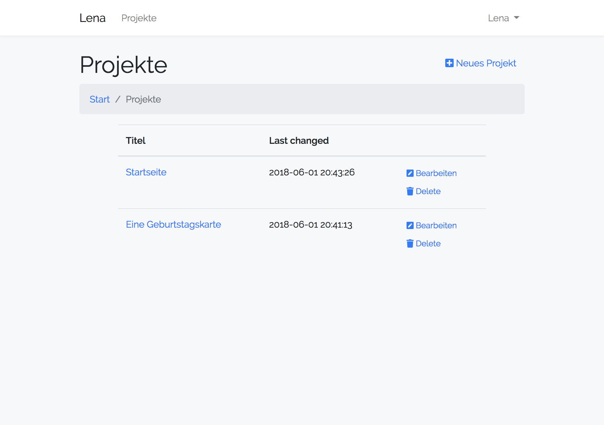

# A simple HTML editor

This repository provides an editor similar to the popular 
[CodePen](https://codepen.io). It is suitable to provide an editor for ones homepage, giving access to the markup as well as stylsheet and scripts.

I have written [a blog post](https://tinkerthon.de/2018/06/editor-fuer-die-homepage) about it.

Please see the file LICENSE.md for information about the open source license used.

Here are some screenshots of the editor:

Taken from https://projects.raspberrypi.org/en/projects/happy-birthday
